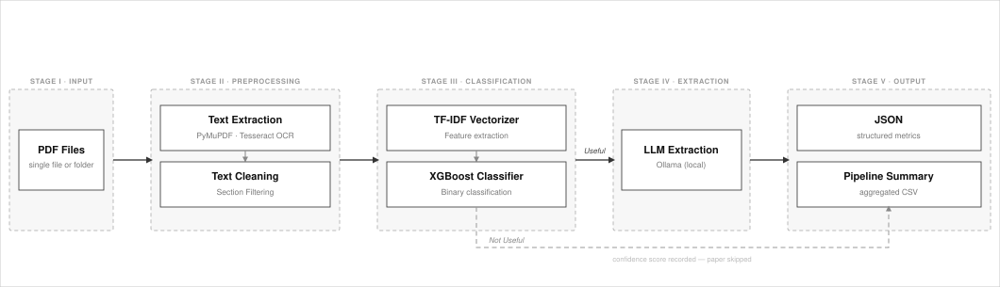
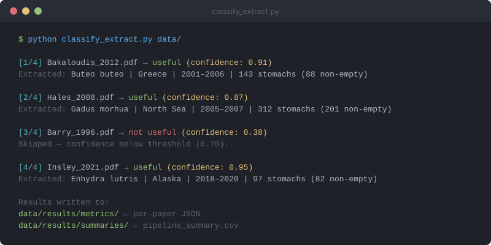
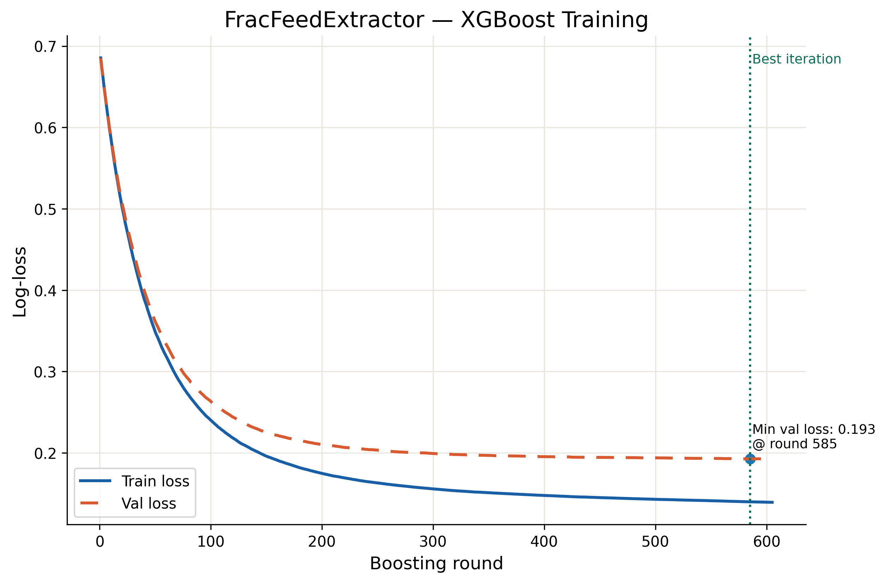

# FracFeedExtractor — LLMs for the Fraction of Feeding Predators

**An automated pipeline that reads ecological literature and extracts predator feeding-rate data — turning hundreds of PDFs into a structured, analysis-ready database.**


[](https://github.com/NovakLabOSU/FracFeedExtractor/issues)

*2025–2026 Oregon State University Senior Capstone Project, in collaboration with Mark Novak.*

[**→ Try It Yourself**](#get-started)

---

<p align="center">
  
</p>
<p align="center"><em>Predator diet surveys form the foundation for estimating the fraction of feeding individuals across species.</em></p>

## Project Description

This project contributes to validating a novel metric of predator-prey interaction, the **fraction of feeding individuals**, that has the potential to inform ecosystem-based resource management and ecological theory at scale. Given a folder of PDFs from the ecological literature, our pipeline screens each paper with a trained XGBoost classifier, routes relevant papers to a locally-run LLM for structured data extraction, and exports a JSON with classification confidence and extraction provenance attached to every record, overcoming the data harvesting bottleneck that has hindered validation of this metric.

---

## What is the Fraction of Feeding Individuals?

The **fraction of feeding individuals** is defined as the proportion of predators found to have non-empty stomachs at the time of sampling. This is a quantity that can be obtained directly from routine predator diet surveys. Research from [Mark Novak's lab at Oregon State University](https://github.com/NovakLabOSU) has established that this metric is analytically linked to a species' metabolic demand, body size, temperature, mortality rate, extinction susceptibility, biological control effectiveness, and population resilience to perturbation, making it a powerful and underutilized parameter for ecosystem-based resource management.

Despite its potential, the metric is rarely used in practice. The underlying data exists across more than a century of published predator diet surveys, but harvesting it by hand from the primary literature is prohibitively slow at the scale required for meaningful cross-species analysis. FracFeedExtractor was built to solve that bottleneck: given a collection of PDFs, it automatically identifies which papers contain usable diet survey data and extracts the key numbers and covariates needed to compute the fraction of feeding individuals.

---

## Key Features

- **PDF Classification** — A trained XGBoost classifier identifies which scientific publications contain useful predator diet survey data, filtering out irrelevant papers before they reach the LLM.
- **Structured Data Extraction** — Automatically parses empty and non-empty stomach counts and key covariates (predator identity, survey location, survey year, and more) from tabular and narrative text.
- **Batch Processing** — Accepts a single PDF or an entire folder of PDFs in one command.
- **Provenance & Uncertainty Reporting** — Every result includes the classifier confidence score and an extraction provenance descriptor identifying the source sentence or table for each field, making downstream QA straightforward.
- **Locally-Run LLM** — The extraction model runs entirely on-device via [Ollama](https://ollama.com). Unpublished manuscripts and proprietary datasets never leave the researcher's environment.

---

## Motivation

Predator-prey interactions are central to ecosystem stability, yet predator feeding rates are rarely used in practice because the data required to estimate them are difficult to obtain at scale. To validate the fraction of feeding individuals metric for mainstream resource management and ecological theory, a scalable method is needed to harvest the untapped data that already exists in the vast ecological literature, accumulated over more than a century of field surveys conducted across the globe.

We trained an XGBoost classifier on the [FracFeed global database](https://github.com/marknovak/FracFeed_DB), a hand-annotated collection of predator diet surveys spanning 135 years and multiple continents, to recognize relevant publications so the LLM only processes papers likely to yield usable data. An LLM running locally via Ollama then extracts the numbers of empty and non-empty stomachs and key covariates from each relevant paper. The resulting pipeline enables the generation of a comprehensive database for subsequent analyses and applications.

---


## System Architecture

Our two-stage pipeline combines a lightweight classifier with a locally-run LLM to minimize cost and runtime at scale. The classifier acts as a gate — only papers it scores as useful proceed to the more expensive extraction step.

<p align="center">
  
</p>

<p align="center"><em>Five-stage pipeline architecture. PDF files are preprocessed, filtered, and classified before useful papers proceed to LLM data extraction and structured output.</em></p>

The pipeline consists of the following components:

1. **PDF Text Extraction** — PyMuPDF parses each PDF; Tesseract OCR handles scanned documents.
2. **Text Cleaning & Section Filtering** — References, captions, and irrelevant paragraphs are stripped to reduce noise before classification.
3. **XGBoost Classifier** — TF-IDF features feed a trained XGBoost model that scores each paper as useful or not useful with a confidence score.
4. **LLM Extraction** — Relevant papers are passed to a locally-run LLM (via Ollama) with a structured prompt, returning a `PredatorDietMetrics` JSON object containing stomach counts, predator identity, survey location, and survey year.
5. **Output** — Per-paper JSON files and a pipeline summary CSV are written to `results/`.

---

## Pipeline Demo

Below is a condensed view of a typical pipeline run on a folder of PDFs. The classifier scores each paper and routes it while relevant papers proceed to LLM extraction.

<p align="center">
  
</p>
<p align="center"><em>FracFeedExtractor pipeline run on a folder of PDFs.</em></p>

---

## Model Performance

The classifier was evaluated on a held-out test set of 234 papers. It achieves **94% accuracy** across both relevant and irrelevant publications, with strong and balanced precision and recall.

| Class | Precision | Recall | F1-score | Support |
|---|---|---|---|---|
| Not useful (0) | 0.96 | 0.91 | 0.93 | 110 |
| Useful (1) | 0.92 | 0.97 | 0.94 | 124 |
| **Overall** | **0.94** | **0.94** | **0.94** | **234** |

<p align="center">
  
</p>

<p align="center"><em>XGBoost classifier training curve. Log-loss for train (blue) and validation (dashed orange) sets across 600 boosting rounds. Early stopping selected round 585 as the best iteration (min val loss: 0.193).</em></p>

---

## Get Started

### Prerequisites

| Dependency | Notes |
|---|---|
| Python 3.10+ | Tested on 3.10–3.12 |
| [Ollama](https://ollama.com) | Must be running locally; 8 GB RAM minimum, 16 GB recommended |
| Tesseract OCR | System-level install required for scanned PDFs — see [Contributing Guide](documentation/CONTRIBUTING.md) for platform-specific instructions |

Pull the default extraction model before running:

```bash
ollama pull qwen3:30b   # ~20 GB
ollama list
```

### Installation

```bash
# Linux
git clone https://github.com/NovakLabOSU/FracFeedExtractor.git
cd FracFeedExtractor
python3 -m venv venv
source venv/bin/activate
pip install -e ".[dev]"
pip install pre-commit
pre-commit install
```

```powershell
# Windows PowerShell
git clone https://github.com/NovakLabOSU/FracFeedExtractor.git
cd FracFeedExtractor
py -m venv venv
.\venv\Scripts\Activate.ps1
pip install -e ".[dev]"
pip install pre-commit
pre-commit install
```

The `pre-commit install` step registers a Git hook that runs Black automatically before each commit. This prevents formatting drift from failing CI.

### Configuration

Copy the environment template and fill in your credentials:

```bash
cp .env.example .env
```

Open `.env` and set the variables relevant to your workflow:

- `GOOGLE_SERVICE_ACCOUNT_JSON` — full JSON key for the Google Cloud service account (ask the project owner). Required for Google Drive mode.
- `GOOGLE_DRIVE_ROOT_FOLDER_ID` — the ID from your Drive folder's URL (`drive.google.com/drive/folders/<ID>`). Required for Google Drive mode.
- `GOOGLE_DRIVE_USE_SHARED_DRIVE` — set to `true` for a Shared/Team Drive; leave blank otherwise.
- `ANTHROPIC_API_KEY` — only required when using Anthropic Claude models for extraction (e.g., `--llm-model claude-haiku-4-5-20251001`).

The `.env` file is gitignored and must never be committed.

### Quick Start

```bash
# Open a folder-picker dialog to select your PDFs
python fracfeedextract

# Or pass the folder path directly
python fracfeedextract path/to/pdfs/

# Use a different model or confidence threshold
python fracfeedextract path/to/pdfs/ --llm-model qwen3:30b --confidence-threshold 0.70
```

Results are written to `results/metrics/` (per-paper JSON) and `results/summaries/` (pipeline CSV).

### Switching Models

The pipeline supports both locally-run and API-based models via the `--llm-model` flag.

**Local (Ollama)** — runs on-device; no API key or internet connection required. Pull the model once before first use.

```bash
ollama pull qwen3:30b
python fracfeedextract path/to/pdfs/ --llm-model qwen3:30b
```

**Anthropic API** — requires `ANTHROPIC_API_KEY` in `.env`; calls are metered. No `ollama pull` needed.

```bash
python fracfeedextract path/to/pdfs/ --llm-model claude-haiku-4-5-20251001
```

The default model (`qwen3:30b`), the extraction prompt, and all extraction fields are configured in `src/config.py` — edit them there to change behavior without touching any other file.

> For virtual environment setup, full CLI flag reference, and contribution guidelines, see the [Contributing Guide](documentation/CONTRIBUTING.md).

### Customizing Extraction Fields

All extraction fields are defined in `src/config.py` as a `FIELDS` list of `FieldSpec` entries. Adding, removing, or modifying a field requires editing only that file — the Pydantic model, LLM prompt, CSV output, retry hints, and merge logic are all derived from `FIELDS` automatically.

**Adding a field** — append a `FieldSpec` to `FIELDS` and update `_PROMPT_EXAMPLES` in the same file:

```python
from typing import Optional

FieldSpec(
    name="latitude",            # snake_case key used everywhere
    python_type=Optional[float],
    prompt_type="float or null",
    description="Decimal latitude of the primary collection site (e.g., -46.9 for Marion Island).",
    csv_label="Latitude",
    retryable=True,
    hint="- latitude: Look for coordinates in the Study Area or Methods section.\n",
    ge=-90.0,
    le=90.0,
),
```

**Removing a field** — delete its `FieldSpec` entry from `FIELDS`. The field disappears from the model schema, prompt, CSV columns, and merge logic automatically.

**Built-in `normalizer` strings** — the following string values can be passed to `normalizer` to apply pre-built normalization logic:

| String | Applies to | Effect |
|---|---|---|
| `"year_range"` | string fields | Extracts `YYYY` or `YYYY-YYYY` from free-form text |
| `"year"` | string fields | Extracts ceiling-midpoint year from free-form text |
| `"month"` | string fields | Normalizes month names / bare digits to `"MM"` |
| `"day"` | string fields | Normalizes bare digit day values to `"DD"` |

A plain callable (function taking `value` and returning `value`) is also accepted for custom normalization.

**Constraints** — `FieldSpec` supports `pattern` (regex), `min_length`, `max_length`, `ge`, `le`, and `gt`; all are optional. Errors in these attributes (bad regex, `ge > le`, unsupported `python_type`) are caught at import time with a clear message.

After adding a field, run `pytest tests/` to confirm the existing tests still pass.

---

## Extracting PDFs from Google Drive

PDFs stored on Google Drive can be processed directly using `scripts/full_pipeline.py --api`. This streams PDFs from Drive, runs the full classify-and-extract pipeline, and saves results locally.

**Required Drive folder structure:**

```text
<GOOGLE_DRIVE_ROOT_FOLDER_ID>/
├── useful/        ← PDFs to be classified and extracted
└── not-useful/    ← (optional) papers already known to be irrelevant
```

**Steps:**

1. Complete the [Configuration](#configuration) step above to create your `.env` file and set the Google Drive variables.
2. Run:

```bash
python scripts/full_pipeline.py --api
```

Run `python scripts/full_pipeline.py --help` for additional flags (e.g. `--max-files`, `--output-dir`).

---

## Data Source

We trained the classifier on the [FracFeed global database](https://github.com/marknovak/FracFeed_DB) — a hand-annotated collection of predator diet surveys from the primary ecological literature. The full training corpus consists of 667 labeled papers (619 useful, 48 not useful); their labels are recorded in `data/labels.json` and the trained model artifacts are committed to `src/classifier/models/`. The source PDFs and their extracted `.txt` files are not committed to this repository — to retrain, populate `data/useful/` and `data/not-useful/` with the full corpus from FracFeed_DB, run `python src/io/generate_labels.py` to regenerate `labels.json`, extract text with `python src/io/pdf_text_extraction.py`, then run `python src/classifier/train_model.py`.

---

## Team

<table>
  <tr>
    <td align="center">
      <a href="https://github.com/marknovak">
        
      </a><br/>
      <b>Mark Novak</b><br/>
      <sub>Project Lead</sub><br/>
      <sub><a href="mailto:Mark.Novak@oregonstate.edu">Mark.Novak@oregonstate.edu</a></sub>
    </td>
    <td align="center">
      <a href="https://github.com/SeanClay10">
        
      </a><br/>
      <b>Sean Clayton</b><br/>
      <sub>ML Pipeline &amp; Backend</sub><br/>
      <sub><a href="mailto:claytose@oregonstate.edu">claytose@oregonstate.edu</a></sub>
    </td>
    <td align="center">
      <a href="https://github.com/QuiteRocks">
        
      </a><br/>
      <b>Zahra Alsulaimawi</b><br/>
      <sub>LLM Integration &amp; Evaluation</sub><br/>
      <sub><a href="mailto:alsulaza@oregonstate.edu">alsulaza@oregonstate.edu</a></sub>
    </td>
    <td align="center">
      <a href="https://github.com/raymondcen">
        
      </a><br/>
      <b>Raymond Cen</b><br/>
      <sub>Data Processing &amp; Testing</sub><br/>
      <sub><a href="mailto:cenra@oregonstate.edu">cenra@oregonstate.edu</a></sub>
    </td>
    <td align="center">
      <a href="https://github.com/bradleyrule">
        
      </a><br/>
      <b>Bradley Rule</b><br/>
      <sub>PDF Extraction &amp; OCR</sub><br/>
      <sub><a href="mailto:ruleb@oregonstate.edu">ruleb@oregonstate.edu</a></sub>
    </td>
  </tr>
</table>

---

## Questions and Feedback

Found a bug or have a question?  
[Open an issue on GitHub](https://github.com/NovakLabOSU/FracFeedExtractor/issues)

---

## Repository Layout

| Directory | Purpose |
| --- | --- |
| `data/` | Training/test fixtures. `useful/` and `not-useful/` contain a committed sample of 20 labeled PDFs used as integration-test fixtures and usage examples — they are **not** the full training corpus (see [Data Source](#data-source)). `processed-text/` holds extracted plain-text intermediates. |
| `results/` | Pipeline output (git-ignored). `metrics/` holds one JSON file per useful paper; `summaries/` holds the pipeline summary CSV. Created automatically on first run. |
| `tests/` | Automated `pytest` test suite that verifies code correctness. Each `test_*.py` file exercises a specific module in isolation. `tests/test.pdf` is a minimal synthetic fixture used by those tests so they run without a model, OCR stack, or the real papers in `data/`. |

---

## Documentation

- [Contributing Guide](documentation/CONTRIBUTING.md) — setup, CLI reference, and contribution workflow
- [System Architecture Diagram](assets/architecture.svg)

*License: Pending partner confirmation.*
